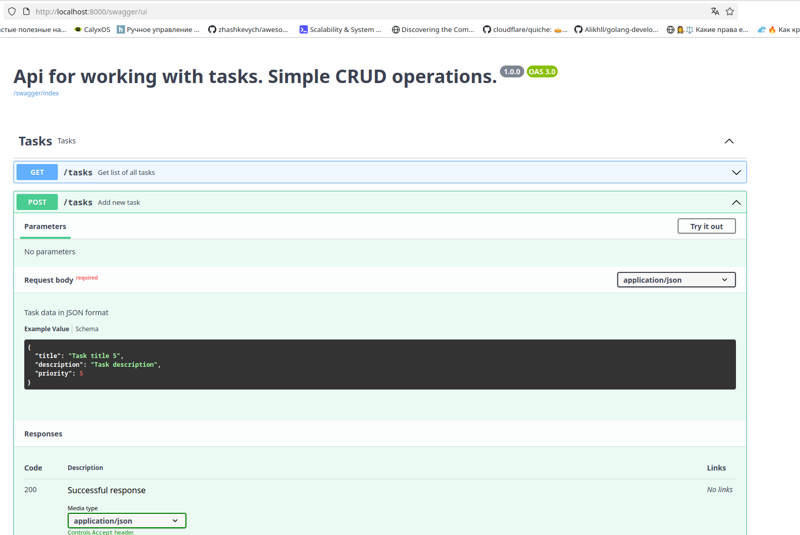

# Запуск проекта

## Склонировать проект, например, по ssh

> git clone git@github.com:igorkt/tasks.git

## Создать файл с переменными окружения

Из корня проекта выполнить:

> cp .env.example .env

Далее запустить проект в докер контейнере

> docker compose up -d

## Postman

Постман коллекция в файле tasks.postman_collection.json
Там запросы к api

## Запуск тестов

Зайти в контейнер с php и yii2

> docker exec -it tasks-php-1 bash  

Далее выполнить

> vendor/bin/codecept run Api

Так же реализована сваггер документация

Получить доступ к документации можно по адресу 

> http://localhost:8000/swagger/ui

